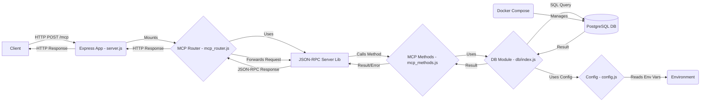
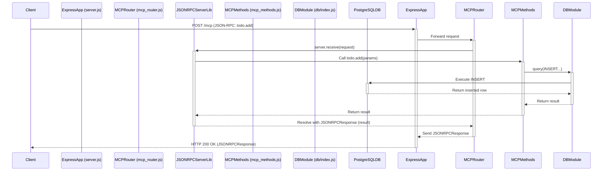

# toyMCP To-Do List Server - Architecture Overview

This document provides a high-level overview of the architecture for the toyMCP To-Do List server.

## 1. Goal

The primary goal is to create a simple web server that exposes a CRUD (Create, Read, Delete - List instead of Read) API for managing a To-Do list. Communication follows the Model Context Protocol (MCP) concepts, implemented using the JSON-RPC 2.0 specification over HTTP POST requests. The application follows a Test-Driven Development (TDD) approach.

## 2. Technology Stack

*   **Runtime:** Node.js
*   **Web Framework:** Express.js
*   **Database:** PostgreSQL (managed via Docker Compose)
*   **Database Client:** `pg` (node-postgres)
*   **JSON-RPC Handling:** `json-rpc-2.0` library
*   **Configuration:** `dotenv` for environment variables
*   **Testing:** Jest (framework), Supertest (HTTP integration testing)
*   **Containerization:** Docker, Docker Compose

## 3. Key Components & Layers

The project is structured into several key components located primarily within the `src/` directory:

*   **`src/server.js` (Server Entry Point):**
    *   Initializes the Express application.
    *   Applies necessary middleware (e.g., `express.json()` for parsing request bodies).
    *   Includes a dedicated error handler middleware immediately following `express.json()` to catch JSON syntax errors and return a specific JSON-RPC Parse Error (-32700).
    *   Mounts the MCP router (`mcp_router.js`) at the `/mcp` path.
    *   Includes a basic root route (`/`) for health checks.
    *   Defines a global error handling middleware to catch unhandled errors and format responses (including specific handling for JSON parsing errors).
    *   Contains the `startServer` function which initializes the database (`initializeDatabase`) before starting the HTTP listener.

*   **`src/mcp_router.js` (MCP Request Router):**
    *   An Express Router specifically for handling requests to the `/mcp` endpoint.
    *   Instantiates `JSONRPCServer` from the `json-rpc-2.0` library.
    *   Registers all methods defined in `mcp_methods.js` with the `JSONRPCServer` instance.
    *   Defines a POST route handler that takes the incoming request body (`req.body`), passes it to `server.receive()`, and sends the resulting JSON-RPC response (or a 204 for notifications) back to the client. It includes basic error handling for issues within the `receive` process itself.

*   **`src/mcp_methods.js` (Business Logic):**
    *   Contains the actual implementation logic for each defined JSON-RPC method (`todo.list`, `todo.add`, `todo.remove`).
    *   Performs input validation on parameters received from the JSON-RPC request. Throws `JSONRPCErrorException` with appropriate codes (-32602 for invalid params, custom 1001 for Not Found) if validation fails.
    *   Interacts with the database layer (`db.query`) to perform the required actions (SELECT, INSERT, DELETE).
    *   Formats the data retrieved from the database into the expected result structure for the JSON-RPC response.
    *   Propagates database errors upwards to be handled by the `JSONRPCServer` or global error handler.

*   **`src/db/` (Database Interaction Layer):**
    *   `index.js`:
        *   Uses the `pg` library to create a PostgreSQL connection pool (`Pool`) configured via `src/config.js`.
        *   Exports the `pool` and a convenience `query` function for executing SQL statements.
        *   Exports an `initializeDatabase` async function that reads `schema.sql` and executes it to ensure the `todos` table exists.
    *   `schema.sql`: Contains the `CREATE TABLE IF NOT EXISTS todos (...)` SQL statement defining the structure of the to-do list table.

*   **`src/config.js` (Configuration):**
    *   Uses `dotenv` to load environment variables from a `.env` file (if present) into `process.env`.
    *   Exports a configuration object containing database connection details (`db.host`, `db.port`, etc.) and the server port (`server.port`), using environment variables or sensible defaults.

*   **`docker-compose.yml` (Persistence Service):**
    *   Defines the `db` service using the official `postgres` Docker image.
    *   Maps the standard PostgreSQL port (5432).
    *   Sets necessary environment variables (`POSTGRES_USER`, `POSTGRES_PASSWORD`, `POSTGRES_DB`) used by the PostgreSQL image on startup and referenced (via defaults or `.env`) in `src/config.js`.
    *   Defines a named volume (`postgres_data`) to ensure data persistence across container restarts.

*   **`tests/` (Automated Tests):**
    *   Tests are organized into subdirectories:
        *   `unit_tests/`: Contains unit tests that typically mock external dependencies (like the database or other modules) to test components in isolation.
            *   `db_init_logic.test.js`: Tests the retry and error handling logic within `src/db/index.js`'s `initializeDatabase` function using mocks.
            *   `mcp_methods.test.js`: Unit tests for the business logic in `src/mcp_methods.js`. Uses `jest.mock` to mock the `src/db` module.
            *   `server_error_handling.test.js`: Tests the error handling middleware in `src/server.js` using mocks.
        *   `integration_tests/`: Contains integration tests that verify the interaction between multiple components, often including real database connections.
            *   `db_integration.test.js`: Integration tests verifying the database connection, schema initialization, and basic SQL operations against the real database instance.
            *   `server_integration.test.js`: Integration tests for the full HTTP request/response cycle using `supertest`. Interacts with the real database.
    *   `setup.js`: Jest setup file used via `setupFilesAfterEnv` to configure the test environment (e.g., redirecting console output).

## 4. Architecture Diagrams

### Component Diagram

### Sequence Diagram (`todo.add` Flow)

## 5. Request Flow Example (`todo.add`)

1.  **Client:** Sends HTTP `POST /mcp` with `Content-Type: application/json` and body: `{"jsonrpc": "2.0", "method": "todo.add", "params": {"text": "New Task"}, "id": 123}`.
2.  **Express (`server.js`):** Receives the request.
3.  **Middleware (`express.json()`):** Parses the JSON body into `req.body`.
4.  **Routing (`server.js`):** Matches `/mcp` and forwards the request to `mcpRouter`.
5.  **Router (`mcp_router.js`):** Matches the `POST /` route.
6.  **JSON-RPC Server (`mcp_router.js`):** The route handler calls `server.receive(req.body)`.
7.  **Method Dispatch (`json-rpc-2.0` library):** The library parses the request, identifies the `"method": "todo.add"`, finds the registered function `mcpMethods['todo.add']`, and prepares to call it with `req.body.params` (i.e., `{"text": "New Task"}`).
8.  **Business Logic (`mcp_methods.js`):** The `todo.add` function is executed:
    *   Validates that `params.text` exists and is a non-empty string.
    *   Calls `db.query('INSERT INTO todos(text) VALUES($1) RETURNING *', ['New Task'])`.
9.  **Database Layer (`db/index.js`):** The `query` function uses the connection pool (`pool`) to send the SQL statement and parameters to the PostgreSQL database.
10. **PostgreSQL:** Executes the `INSERT`, creates the new row, and returns the complete row data.
11. **Database Layer (`db/index.js`):** `pool.query` resolves with the result from PostgreSQL.
12. **Business Logic (`mcp_methods.js`):** The `todo.add` function receives the result (e.g., `{ rows: [{ id: 5, text: 'New Task', created_at: ... }] }`) and returns `result.rows[0]`.
13. **JSON-RPC Server (`mcp_router.js`):** The `server.receive()` promise resolves with a successful JSON-RPC response object containing the result from `todo.add`: `{"jsonrpc": "2.0", "result": {"id": 5, ...}, "id": 123}`.
14. **Router (`mcp_router.js`):** The `.then()` callback receives the `jsonRPCResponse` and sends it back to the client using `res.json(jsonRPCResponse)`.
15. **Client:** Receives the `200 OK` HTTP response with the JSON-RPC success payload.

(Error flows would involve `JSONRPCErrorException` being thrown in `mcp_methods.js`, caught by the `json-rpc-2.0` library, and formatted into a JSON-RPC error response within `server.receive()`).

## 6. TDD Approach

Development followed a Test-Driven Development cycle:
1.  Write a test (unit or integration) for a specific piece of functionality (e.g., listing todos, handling invalid parameters).
2.  Run the tests; the new test is expected to fail.
3.  Implement the minimum amount of code required to make the test pass.
4.  Run all tests again; ensure they all pass.
5.  Refactor the code if necessary, ensuring tests continue to pass.
This cycle was repeated for database interactions, business logic methods, and server endpoints. 